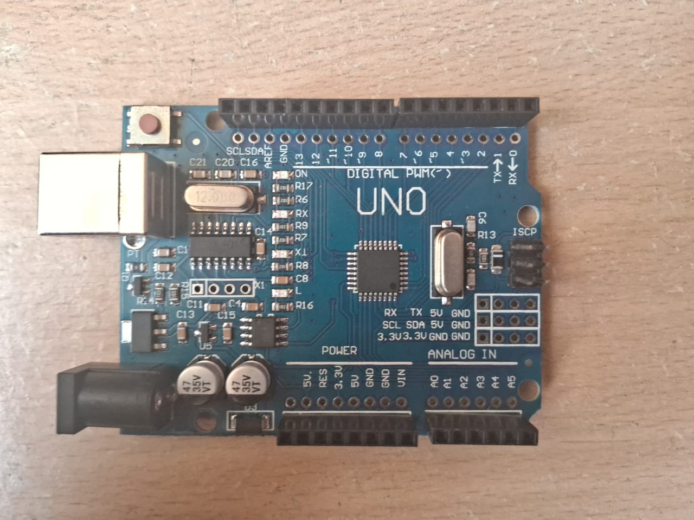
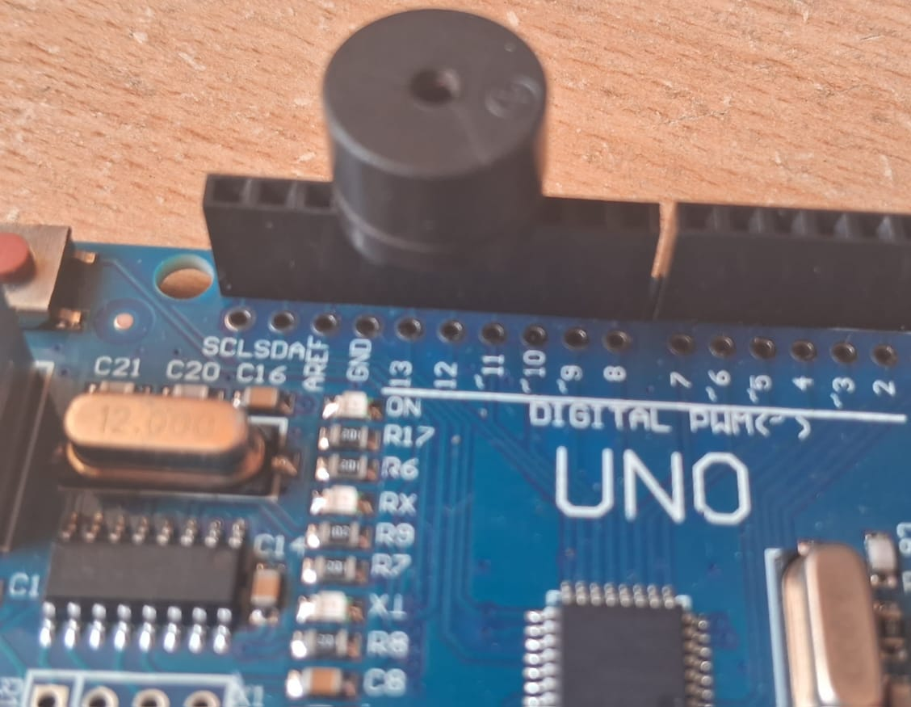
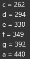
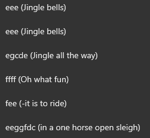

# Arduino buzzer music player - My first Iot (2023)

>This was my first cool arduino project. Back in 11th grade this was one of my proudest accomplishments. Hearing the buzzer play sound for the first time gave me a tingling sensation in my stomache, but then I realised it was probably just gas from the chakkakuru that I ate...

## Jingle bells Sketch



The following sketch plays Jingle bells through a buzzer connected to an Arduino.
You can try it out with other songs as well, if you have the right sheet music.

### Materials and components required
- Arduino UNO or similar
- Piezoelectric buzzer (Use reistance in series)

### Wiring
Connect the buzzer's positive pin to digital pin **8** and its negative pin to **GND**. 
if you use another suitable pin, update the `buzzer` variable.


### Howto play
Upload the sketch to arudio using IDE, and the song shall play via the buzzer...
Press the reset button to play the song again.

## How it works

Aquire the notes of your desired song from a sheet music or any other source...
and then just add those notes to the tone() function as per the chart, which corresponds to the 
frequency at which each of them sound...

```chart```

```jingle bells music refenence```


To make it easier we store them as their note variables (Keep in mind that this shall get confusing as we move up or down an octave)
`int c = 262, d = 294, e = 330, f = 349, g = 392, a = 440, b = 494;`

The `tone()` function generates a square wave note with corresponding freqency variable, 
`delay()` controls each note's timing.

put it inside the setup function or in loop and enjoy your music ad free...

### [VIDEO TUTORIAL / DEMO](https://youtu.be/-TrfSezAbA8?si=6G-Wzi2inU2-WxlL)
[](https://youtu.be/-TrfSezAbA8?si=6G-Wzi2inU2-WxlL)